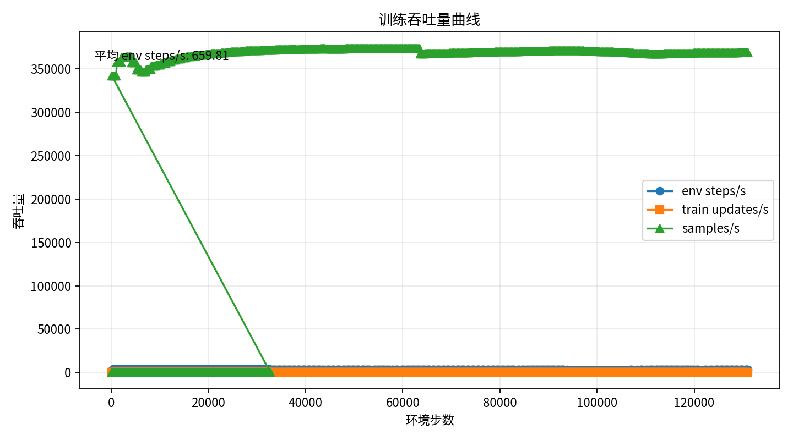
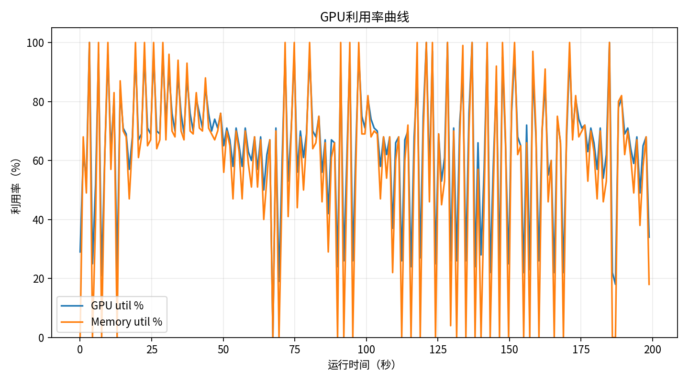
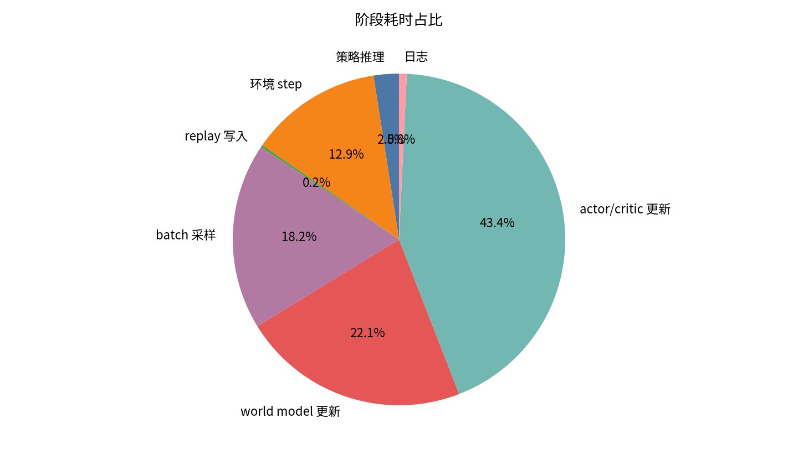
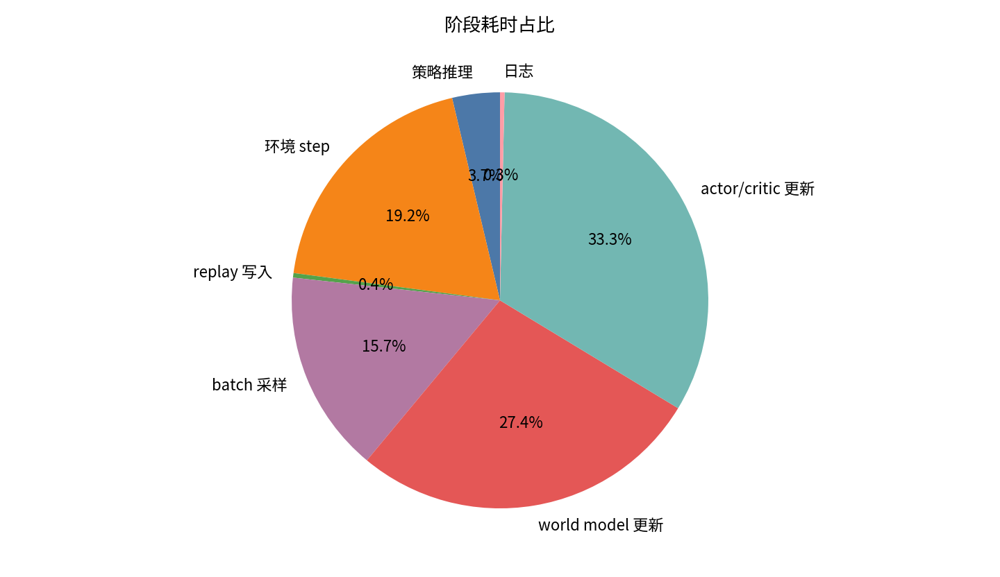

# 实验记录：4090训练加速参数对比

## 1. 实验目的

- 对比 baseline、4090 balanced、4090 fast 三组参数在 warmup 后带更新阶段的真实训练吞吐。
- 验证降低更新/采样比例、增大 batch、启用 TF32 后，RTX 4090 是否获得明显 wall-clock 加速。
- 估算当前默认 10M env steps 训练大致耗时。

## 2. 实验配置

- 日期：2026-06-11
- 任务：`SurgicalRobot5-HeadPipe-GraspGoalDreamerForce-OSC-RL-Direct-v1`
- GPU：RTX 4090 24GB
- 统计口径：每组先 prefill / warmup `32768` env steps，随后统计 `131072` env steps 的 rollout + update。
- 本次 profiling 不测 checkpoint I/O，`WANDB_MODE=disabled`。
- 输出目录：
  - `对比结果/baseline`
  - `对比结果/balanced`
  - `对比结果/fast`

## 3. 核心结果

| 配置 | NumEnvs | Batch | measured env steps/s | 同比 baseline | 采样+更新耗时 | 更新段加速 | GPU 平均利用率 | 显存峰值 | 估算 10M steps |
|---|---:|---:|---:|---:|---:|---:|---:|---:|---:|
| baseline | 64 | 64 | 213.49 | 1.00x | 516.46s | 1.00x | 40.83% | 8134 MiB | 13.01 h |
| balanced | 128 | 128 | 520.89 | 2.44x | 204.34s | 2.53x | 50.23% | 10494 MiB | 5.33 h |
| fast | 128 | 256 | 659.81 | 3.09x | 151.95s | 3.40x | 64.68% | 15214 MiB | 4.21 h |

其中“采样+更新耗时”=`sample_batch_time + world_model_update_time + actor_critic_update_time`，表示 warmup 后测量段中训练更新相关开销。

## 4. 阶段耗时

| 配置 | env step | replay sample | world model update | actor/critic update | 正式测量总时长 |
|---|---:|---:|---:|---:|---:|
| baseline | 79.69s | 112.13s | 136.61s | 267.73s | 613.96s |
| balanced | 38.36s | 61.49s | 58.43s | 84.42s | 251.63s |
| fast | 38.20s | 31.25s | 54.41s | 66.29s | 198.65s |

## 5. 图片

fast 配置 warmup 后的训练吞吐曲线。

fast 配置 GPU 平均利用率为 `64.68%`，峰值达到 `100%`，较 baseline 的 `40.83%` 明显提高，但尚未稳定达到 75%+。

baseline 主要耗时集中在 actor/critic update 与 replay sample。

fast 通过减少更新/采样频率和增大 batch，把同等 env steps 下的更新相关耗时从 `516.46s` 降到 `151.95s`。

## 6. 结论

- 有明显速度提升。fast 配置在 warmup 后带更新阶段达到 `659.81 env steps/s`，是 baseline 的 `3.09x`。
- 只看更新相关部分，fast 将同等 `131072` env steps 的采样+更新耗时从 `516.46s` 降到 `151.95s`，约 `3.40x` 加速。
- balanced 是更保守方案，吞吐 `520.89 env steps/s`，约 `2.44x` baseline。
- fast 显存峰值约 `15.2GB`，没有 OOM，4090 24GB 仍有余量。
- GPU 平均利用率从 baseline `40.83%` 提升到 fast `64.68%`，提升明显，但还未达到 75%+ 目标。
- 后续 W&B 观察显示 fast 接近 `4M env steps` 仍未学会夹取，而原训练约 `1M env steps` 已学会夹取，因此 fast 应视为吞吐上限配置，不宜作为当前默认长训配置。
- 已新增 `configs/reachability_gp_isaaclab22_4090_policy_recovery.yaml`，用于恢复策略更新强度并验证是否兼顾速度和学习能力。

## 7. 训练时间估算

按 warmup 后 measured env steps/s 保守估算：

- baseline：10M env steps 约 `13.01` 小时，1M 约 `78.1` 分钟。
- balanced：10M env steps 约 `5.33` 小时，1M 约 `32.0` 分钟。
- fast：10M env steps 约 `4.21` 小时，1M 约 `25.3` 分钟。

正式训练包含 checkpoint、wandb online、系统负载波动等额外开销，建议把 fast 的 10M steps 预期按 `4.3-4.8` 小时看待。

## 8. 注意事项

- 本次测的是吞吐，不代表样本效率或最终收敛质量。
- fast 大幅减少了每 env step 的更新量，已观察到策略学习能力不足；下一轮不建议继续用 fast 做主实验，应优先测试 `4090_policy_recovery`。
- profiling 修复了 `args.num_envs` 缺失导致的静默退出问题；后续再跑 `运行全部对比.sh` 会正常生成三组指标。
