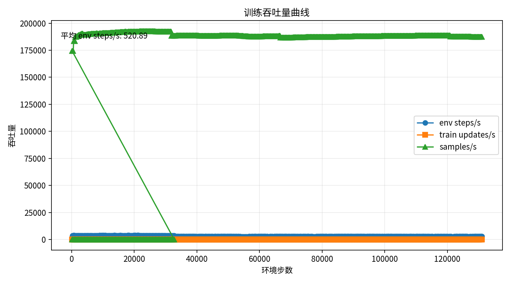
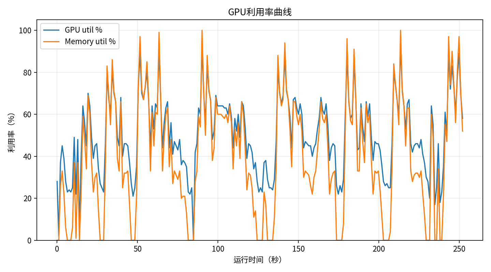
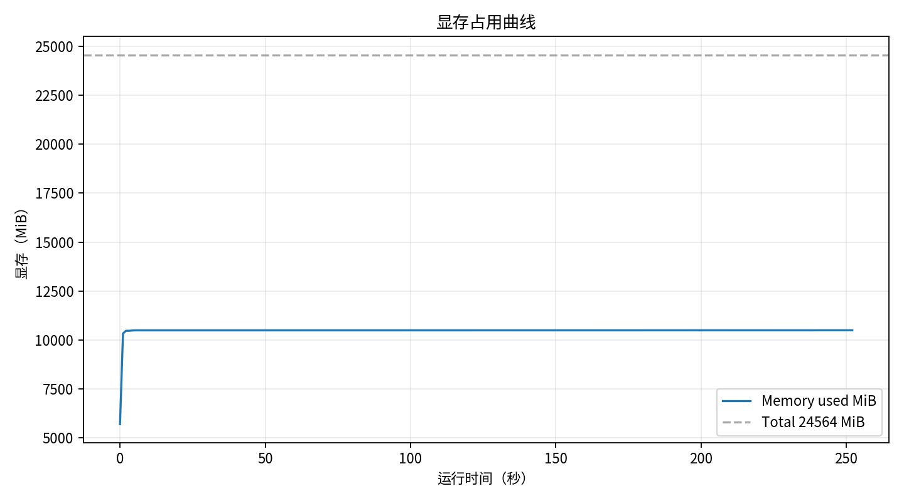
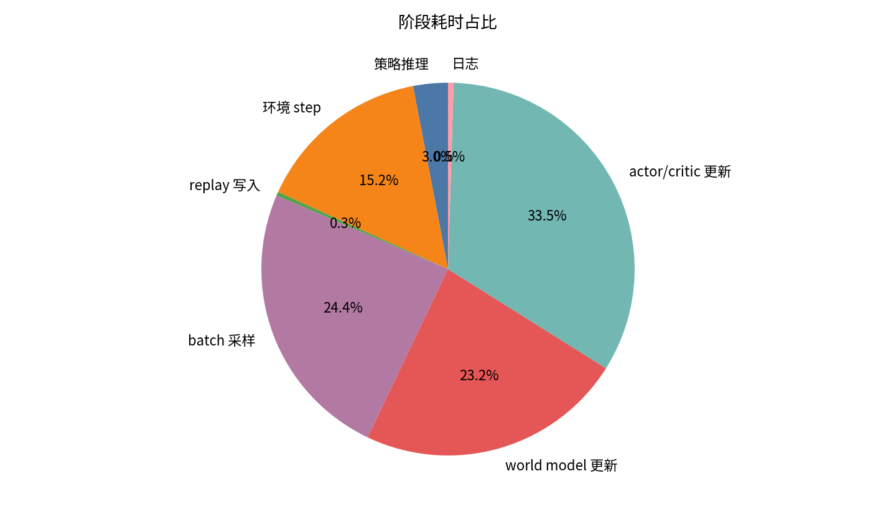

# 实验记录：4090训练加速参数对比

## 1. 实验目的

- 测量当前配置在 RTX 4090 上的实际训练吞吐。
- 分开定位环境 step、策略推理、replay append / sample、world model、Gp/Gd、dual、agent 更新、日志和 checkpoint 的相对耗时。
- 对照 baseline、4090 balanced、4090 fast 三组参数，判断降低更新/采样比例、增大 batch 和启用 TF32 后是否提升 wall-clock 吞吐。

## 2. 实验配置

- 实验日期：2026-06-11
- 训练配置：`/root/gpufree-data/fdpi_reachability_dreamer_clean/configs/reachability_gp_isaaclab22_4090_balanced.yaml`
- 运行入口：`运行命令.sh`
- profiling 配置：`配置.yaml`
- 输出目录：`/root/gpufree-data/fdpi_reachability_dreamer_clean/experiments/2026-06-11_4090训练加速参数对比/对比结果/balanced`
- wandb：disabled，本次只写本地文件。
- NumEnvs：`128`
- BatchSize：`128`
- ImagineBatchSize：`128`
- 更新组合：WM=`2`，Gp=`1`，Gd=`1`，dual=`1`，agent=`2`

## 3. 代码修改

- 新增 4090 fast / balanced 配置和实验归档入口。
- 训练循环加入 timing 日志，replay sampling 增加 starts 缓存，日志频率可配置。
- 默认配置保持可回退，4090 配置通过 `BaseConfig` 覆盖参数。
- 详细改动见 `代码变更.patch`。

## 4. 核心结果

### 4.1 关键图片

图1_训练吞吐量曲线.png：用于观察本次 profiling 的对应速度或 GPU 指标。

图2_GPU利用率曲线.png：用于观察本次 profiling 的对应速度或 GPU 指标。

图3_显存占用曲线.png：用于观察本次 profiling 的对应速度或 GPU 指标。

图4_阶段耗时占比.png：用于观察本次 profiling 的对应速度或 GPU 指标。

### 4.2 关键指标

- 平均环境吞吐：`520.89` env steps/s
- 训练更新吞吐：`12.54` updates/s
- batch 样本吞吐：`187580.77` samples/s
- 平均 GPU 利用率：`50.23%`
- 峰值显存占用：`10494` MiB
- 最大耗时阶段：`actor_critic_update_time`，占比 `33.5%`

## 5. 结果分析

- 当前 profiling 显示主要耗时阶段为 `actor_critic_update_time`。
- 若 GPU 利用率长期偏低且环境 step 占比高，优先怀疑仿真/环境交互瓶颈。
- 若 GPU 利用率较高且更新阶段占比高，优先怀疑 world model 或 actor/critic 训练计算瓶颈。

## 6. 主要问题

- profiling hook 会带来少量同步开销，因此绝对速度略低于完全无 profiling 的训练。
- fast 配置优先 wall-clock 吞吐，可能牺牲一定样本效率，需要后续 1M env steps 长跑确认 reward、cost、Gp/Gd loss 不崩坏。
- 如果 fast 出现 OOM 或安全学习明显变差，优先回退到 balanced，或把 Gp/Gd/Dual UpdateSteps 从 1 恢复到 2。

## 7. 初步结论

- 本次测试给出该配置下的可复现速度、GPU 使用情况和主要耗时阶段。
- 是否采用 fast 作为正式长训参数，应以后续三组对比和 1M env steps 稳定性验证为准。

## 8. 下一步计划

- 先运行 baseline / balanced / fast 三组 profiling，记录 env steps/s、GPU 利用率和 update 占比。
- 选择吞吐和稳定性更好的配置，运行 1M env steps 长跑验证。
